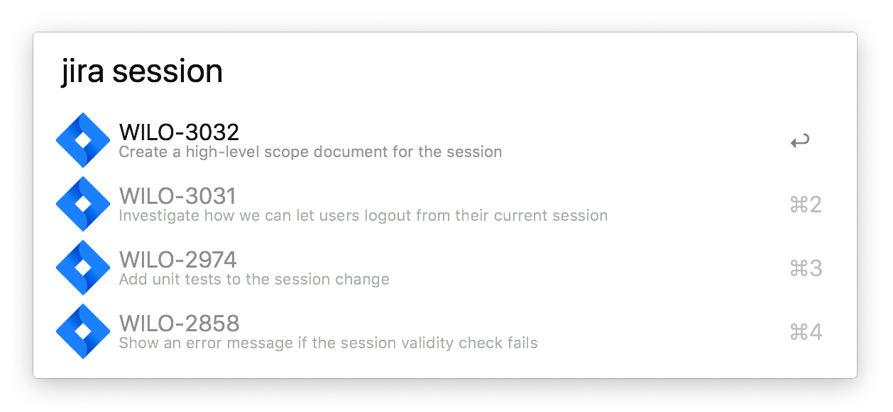

### ⚠️ Disclaimer: I'm no longer actively maintaining this script — I stopped using Alfred and I'm now using [Raycast](https://www.raycast.com/). 

# alfred-jira-search
An Alfred workflow to search for Jira tickets.

   

   

* The workflow is triggered by the **jira** keyword, followed up by the search query.  
* Under the hood the workflow uses the [`/rest/api/3/issue/picker`](https://developer.atlassian.com/cloud/jira/platform/rest/v3/?utm_source=%2Fcloud%2Fjira%2Fplatform%2Frest%2F&utm_medium=302#api-rest-api-3-issue-picker-get) endpoint to return a list of issues matching the Alfred query.  
* It's smart enough to return a list of issues if you're query is a word, or a specific issue if your query is a ticket number.  

⚠️ Disclaimer: I'm no longer actively maintaining this script — I stopped using Alfred and I'm now using [Raycast](https://www.raycast.com/). 

---

The workflow setup still has a huge margin for improvement: I haven't built an authentication flow, so it  requires some manual setup (that I abstracted into three workflow environment variables).   

__A `domain` variable__  
Part of the Jira URL.
E.g. (`https://${domain}.atlassian.net`). 

__An `apitoken` variable__  
The jira API token to use for authentication.
You can generate one in your [jira account settings](https://confluence.atlassian.com/cloud/api-tokens-938839638.html)

__A `username` variable__  
The jira username associated with the API token.
E.g. `foo@bar.com`

It also needs [jq](https://stedolan.github.io/jq/) to be installed.   
